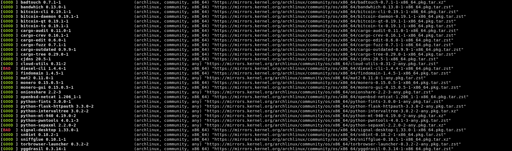
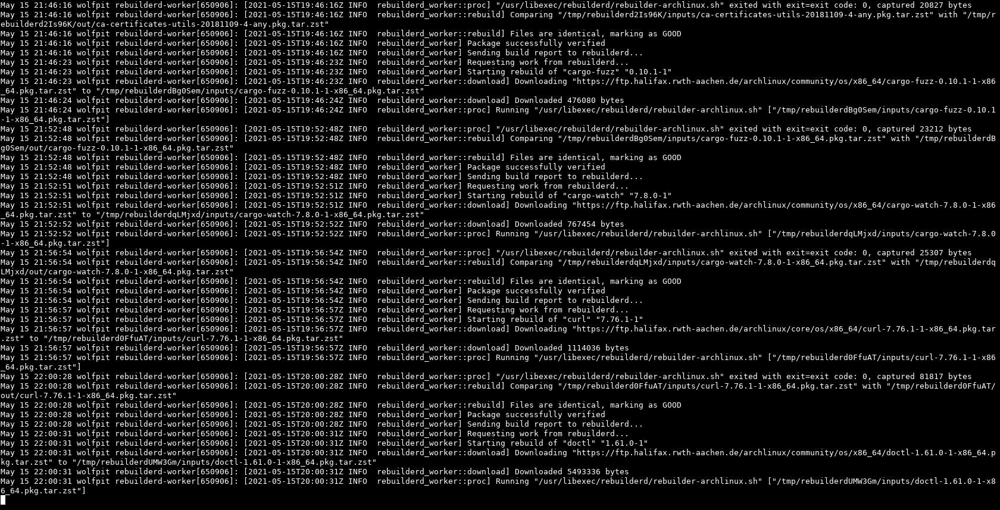

# rebuilderd(1) [![crates.io][crates-img]][crates] [![cncf slack][cncf-img]][cncf] [![irc.libera.chat:6697/#archlinux-reproducible][irc-img]][irc]

[crates-img]:   https://img.shields.io/crates/v/rebuilderd.svg
[crates]:       https://crates.io/crates/rebuilderd
[cncf-img]:     https://img.shields.io/badge/cncf-%23rebuilderd-blue.svg
[cncf]:         https://cloud-native.slack.com/messages/rebuilderd/
[irc-img]:      https://img.shields.io/badge/libera-%23archlinux--reproducible-blue.svg
[irc]:          https://web.libera.chat/#archlinux-reproducible

Independent verification system of binary packages.



- [Accessing a rebuilderd instance in your browser](#accessing-a-rebuilderd-instance-in-your-browser)
- [Scripting access to a rebuilderd instance](#scripting-access-to-a-rebuilderd-instance)
- [Running a rebuilderd instance yourself](#running-a-rebuilderd-instance-yourself)
    - [Rebuilding Arch Linux](#rebuilding-arch-linux) (Supported)
    - [Rebuilding Tails](docs/setup-tails.md)
- [Development](#development)
    - [Dependencies](#dependencies)
- [Funding](#funding)
- [License](#license)

rebuilderd monitors the package repository of a linux distribution and uses
rebuilder backends like [archlinux-repro][1] to verify the provided binary
packages can be reproduced from the given source code.

[1]: https://github.com/archlinux/archlinux-repro

It tracks the state of successfully verified packages and optionally generates
a report of differences with [diffoscope][2] for debugging. Note that due to
the early state of this technology a failed rebuild is more likely due to an
undeterministic build process instead of a supply chain compromise, but if
multiple rebuilders you trust report 100% reproducible for the set of packages
you use you can be confident that the binaries on your system haven't been
tampered with. People are encouraged to run their own rebuilders if they can
afford to.

[2]: https://diffoscope.org/

## Status

| | Status | Docker | Doesn't need --privileged | Doesn't need /dev/kvm | Backend |
| --- | --- | --- | --- | --- | --- |
| **Arch Linux** | ✔️ supported | ❌ | - | ✔️ | [archlinux-repro](https://github.com/archlinux/archlinux-repro) |
| **Debian** | 🚀 planned | ✔️ | ❌ | ✔️ | [debrebuild.pl](https://salsa.debian.org/debian/devscripts/-/blob/master/scripts/debrebuild.pl) |
| **Tails** | ⚠️ experimental | ❌ | - | ❌ | [docs](https://tails.boum.org/contribute/build/)
| **Alpine** | 🚀 planned | - | - | - | - |

**Docker**: There's a docker-compose example setup in this repository, but not
all rebuilder backends support running inside of a docker container (for
example because it's creating containers itself).

**Doesn't need --privileged**: Some rebuilder backends create containers in a
way that works inside of a docker container, if they're granted the required
kernel capabilities to do so. This may have security implications for other
containers running on that system or the code running inside the container may
reconfigure the system outside of the docker container.

**Doesn't need /dev/kvm**: Some build tools may need to start a virtual machine
and depend on /dev/kvm to be available. This is a special requirement for the
hosting environment, you either need a VPS with **Nested KVM** or
dedicated non-virtualized hardware.

# Accessing a rebuilderd instance in your browser

Many instance run a web frontend to display their results. [rebuilderd-website]
is a very good choice and the software powering the Arch Linux rebuilderd
instance:

[rebuilderd-website]: https://gitlab.archlinux.org/archlinux/rebuilderd-website

https://reproducible.archlinux.org/

Loading the index of all packages may take a short time.

# Scripting access to a rebuilderd instance

<a href="https://repology.org/project/rebuilderd/versions"></a>

It's also possible to query and manage a rebuilderd instance in a scriptable
way. It's recommended to install the `rebuildctl` commandline util to do this
(instructions for your system may vary, see packaging status to the right):

    pacman -S rebuilderd-tools

You can then query a rebuilderd instance for the status of a specific package:

    rebuildctl -H https://reproducible.archlinux.org pkgs ls --name rebuilderd

You have to specify which instance you want to query because there's no
definite truth™. You could ask multiple instances though, including one you
operate yourself.

If the rebuilder seems to have outdated data or lists a package as unknown the
update may still be in the build queue. You can query the build queue of an
instance like this:

    rebuildctl -H https://reproducible.archlinux.org queue ls --head

If there's no output that means the build queue is empty.

If you're the administrator of this instance you can also run commands like:

    rebuildctl status

Or immediately retry all failed rebuild attempts (there's an automatic retry on
by default):

    rebuildctl pkgs requeue --status BAD --reset

# Running a rebuilderd instance yourself



"I compile everything from source" - a significant amount of real world binary
packages can already be reproduced today. The more people run rebuilders, the
harder it is to compromise all of them.

At the current stage of the project we're interested in every rebuilder there
is! Most rebuilderd discussion currently happens in #archlinux-reproducible on
libera, feel free to drop by if you're running a instance or considering
setting one up. Having a few unreproducible packages is normal (even if it's
slightly more than the official rebuilder), but having additional people
confirm successful rebuilds is very helpful.

## Rebuilding Arch Linux

Please see the setup instructions in the [Arch Linux Wiki](https://wiki.archlinux.org/index.php/Rebuilderd).

# Development with docker

There is a docker-compose setup in the repo, to start a basic stack simply
clone the repository and run:

```sh
DOCKER_BUILDKIT=1 docker-compose up
```

The initial build is going to take some time.

To recompile your changes (you can optionally specify a specific image to build):

```sh
DOCKER_BUILDKIT=1 docker-compose build
```

To connect to your local instance, use this command to compile and run the `rebuildctl` binary.

```sh
REBUILDERD_COOKIE_PATH=data/auth cargo run -p rebuildctl -- -v status
```

Sync a package index that should be rebuilt (takes a bit):

```sh
REBUILDERD_COOKIE_PATH=data/auth cargo run -p rebuildctl -- pkgs sync archlinux community \
     'https://ftp.halifax.rwth-aachen.de/archlinux/$repo/os/$arch' \
    --architecture x86_64 --maintainer kpcyrd
```

Display the build queue to test it's working:

```sh
REBUILDERD_COOKIE_PATH=data/auth cargo run -p rebuildctl -- queue ls --head
```

Monitor the logs of your workers with those two commands:

```sh
REBUILDERD_COOKIE_PATH=data/auth cargo run -p rebuildctl -- status
REBUILDERD_COOKIE_PATH=data/auth cargo run -p rebuildctl -- pkgs ls
```

# Development

If you want to build from source or you want to run rebuilderd built from a
specific commit this section contains instructions for that.

A rebuilder consists of the `rebuilderd` daemon and >= 1 workers:

First we switch into the `daemon/` folder and run our rebuilderd daemon:
```
cd daemon; cargo run
```

This takes a moment but the api should now be available at
`https://127.0.0.1:8484/api/v0/dashboard`.

This daemon needs to run in the background, so we're starting a new terminal to
continue with the next steps.

Next we're going to build the `rebuilctl binary` and confirm it's able to
connect to the api. If we don't get an error message this means it's working.

```
cd tools; cargo run -- status
```

We didn't connect any workers yet so this output is empty.

Next we want to connect a rebuilder. rebuilderd only does the scheduling for
you, so you need to install additional software here (called a rebuilder
backend):

- **Arch Linux**: `pacman -S archlinux-repro` or `git clone
  https://github.com/archlinux/archlinux-repro && archlinux-repro/ && make &&
  sudo make install`. Note that on debian buster you need to install systemd
  from buster-backports.

With a rebuilder backend installed we're now going to run our first worker:

```
cd worker; cargo run -- connect http://127.0.0.1:8484
```

This rebuilder should now show up in our `rebuildctl status` output:

```
cd tools; cargo run -- status
```

Next we're going to import some packages:

```
cd tools; cargo run -- pkgs sync archlinux community \
    'https://ftp.halifax.rwth-aachen.de/archlinux/$repo/os/$arch' \
    --architecture x86_64 --maintainer kpcyrd
```

The `--maintainer` option is optional and allows you to rebuild packages by a specific maintainer only.

To show the current status of our imported packages run:

```
cd tools; cargo run -- pkgs ls
```

To monitor your workers are picking up tasks:

```
cd tools; cargo build && CLICOLOR_FORCE=1 watch -c ../target/debug/rebuildctl status
```

To inspect the queue run:

```
cd tools; cargo run -- queue ls
```

An easy way to test the package import is using a command like this:
```
cargo watch -- cargo run --bin rebuildctl -- pkgs sync-profile --print-json --sync-config contrib/confs/rebuilderd-sync.conf tails
```

## Dependencies

Debian: pkg-config liblzma-dev libssl-dev libsqlite3-dev libzstd-dev

# Funding

Rebuilderd development is currently funded by:

- ~~kpcyrd's savings account~~
- Google and The Linux Foundation
- People like you and me on [github sponsors](https://github.com/sponsors/kpcyrd)

# License

GPLv3+
